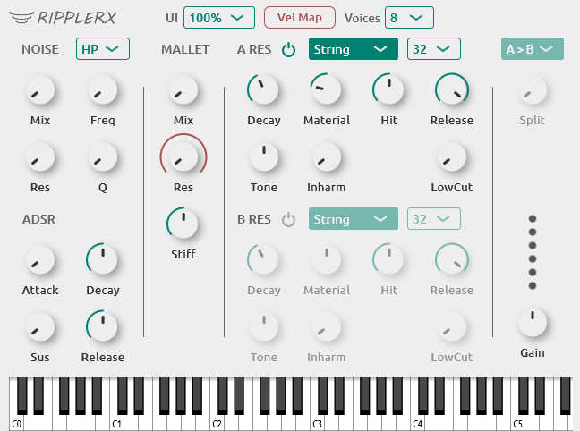
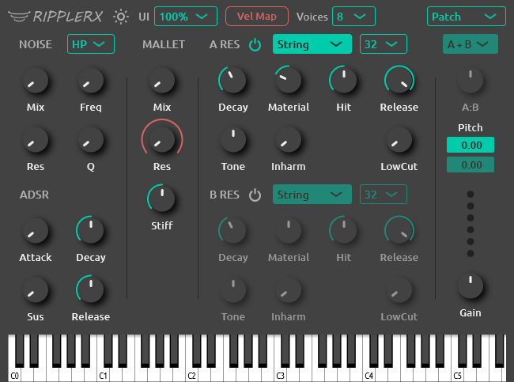

<h1 align="center">
  
  <br>
</h1>
<div align="center">

[](https://github.com/tiagolr/ripplerx/releases)
[](https://github.com/tiagolr/ripplerx/releases)
[](https://github.com/tiagolr/ripplerx/releases)

</div>
<div align="center">

[](https://github.com/tiagolr/ripplerx/releases/latest)


</div>

RipplerX is a physically modeled synth, capable of sounds similar to AAS Chromaphone and Ableton Collision.

<div align="center">





</div>

## Features

  * **Cross-platform** available on Windows, Linux and macOS.
  * **Dual resonators** with serial and parallel coupling.
  * **9 Models** of acoustic resonators: String, Beam, Squared, Membrane, Drumhead, Plate, Marimba, Open tube and Closed tube.
  * **Inharmocity, Tone, Ratio and Material** sliders to shape the timbre.
  * **Noise and mallet** generators.
  * Up to **64 partials** per resonator.
  * Built with **JUCE**.
    
## Download

* [Download latest release](https://github.com/tiagolr/ripplerx/releases)
* Current builds include VST3 and LV2 for Windows, Linux and macOS plus AU for macOS.
* Clap is planned when there is official [JUCE support](https://juce.com/blog/juce-roadmap-update-q3-2024/).

## About

RipplerX is a port of [Rippler2](https://github.com/tiagolr/tilr_jsfx?tab=readme-ov-file#rippler-2)
for the Reaper DAW, it started as a research project into physically modelled drums and ended up a
synth heavily based on AAS Chromaphone and Sai'ke [Partials](https://github.com/JoepVanlier/JSFX?tab=readme-ov-file#partials---modal-synthesis-effect).

The first version was based off Partials since it is one the few open source modal synths I could find, from there
the main reference became Chromaphone and Collision, the controls and models are almost a one to one match.

Ripplerx has additional controls for Inharmonicity and model Ratio and a distinct sound,
Chromaphone is a more complete synth with more features, it has a more sophisticated mallet generator, physics based serial coupling, a better UI, etc..
If you like this synth you should definetly check it out.

The value of RipplerX is as an open source alternative to AAS plugins,
it also provides an entry point for developers or researchers into physical modelling.

**Acknowledgments**

* Saike for the open source Partials synth which the original Rippler was based on.
* AAS for Chromaphone synth and manual with hints about the models and parameters used.
* Nathan Ho and others for articles about [modal synthesis](https://nathan.ho.name/posts/exploring-modal-synthesis).
* DSP coders like Tale and Scott Stillwell for providing open source JSFXs and libs.

## MacOS

MacOS builds are untested and unsigned, please let me know of any issues by opening a ticket, don't expect a promptly fix as I don't have access to that OS.

Because the builds are unsigned you may have to run the following command:

```bash
sudo xattr -dr com.apple.quarantine RipplerX.component
sudo xattr -dr com.apple.quarantine RipplerX.vst3
```

The command above will recursively remove the quarantine flag from the files.

## Microtuning

Microtuning is supported via MTS-ESP, you can install a player like [MTS-ESP MINI](https://oddsound.com/mtsespmini.php) and run it along side RipplerX, the two plugins will communicate and automatically tune Rippler to the config file loaded.

Tuning files can be found for example at https://www.huygens-fokker.org/docs/scales.zip

For more details and a list of players also check this section of [surge tuning guide](https://surge-synthesizer.github.io/tuning-guide/#mts-esp).

## Build

```bash
git clone --recurse-submodules https://github.com/tiagolr/ripplerx.git

# windows
cmake -G "Visual Studio 17 2022" -DCMAKE_BUILD_TYPE=Release -S . -B ./build

# linux
sudo apt update
sudo apt-get install libx11-dev libfreetype-dev libfontconfig1-dev libasound2-dev libxrandr-dev libxinerama-dev libxcursor-dev
cmake -G "Unix Makefiles" -DCMAKE_BUILD_TYPE=Release -S . -B ./build
cmake --build ./build --config Release

# macOS
cmake -G "Unix Makefiles" -DCMAKE_BUILD_TYPE=Release -DCMAKE_OSX_ARCHITECTURES="x86_64;arm64" -S . -B ./build
cmake --build ./build --config Release
```
